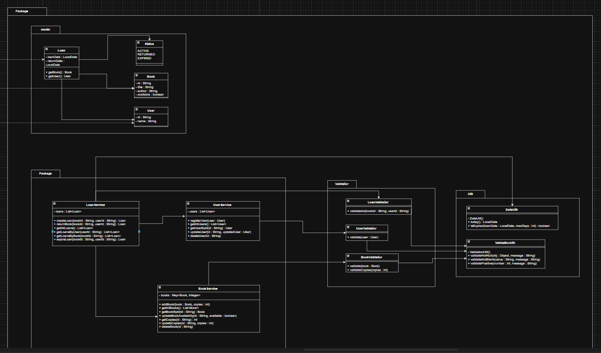
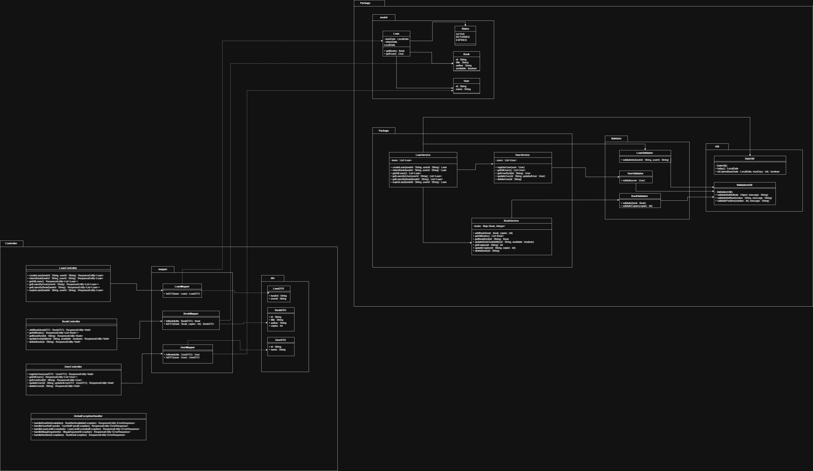
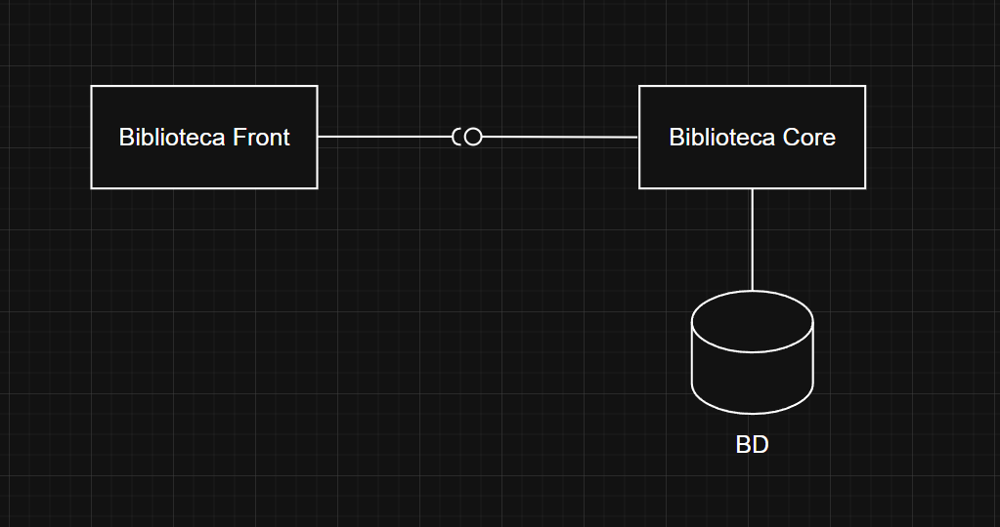
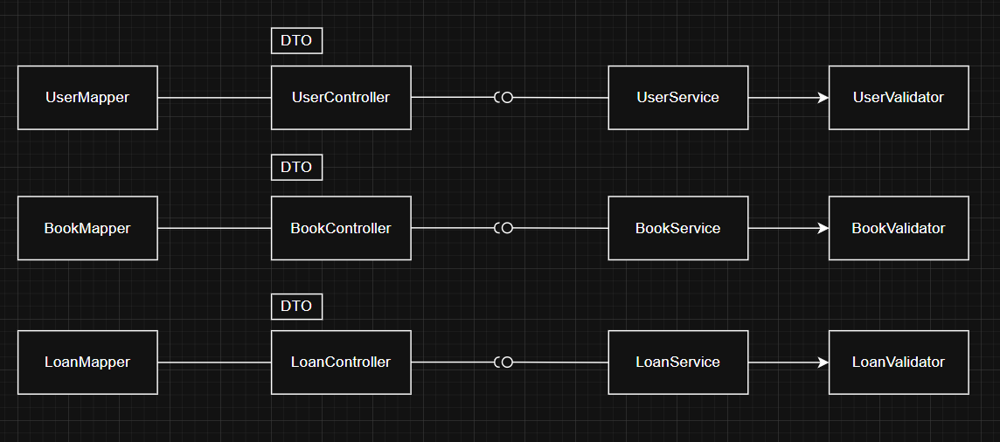
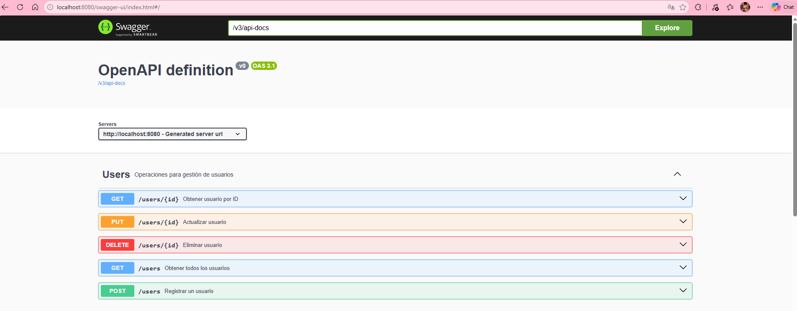
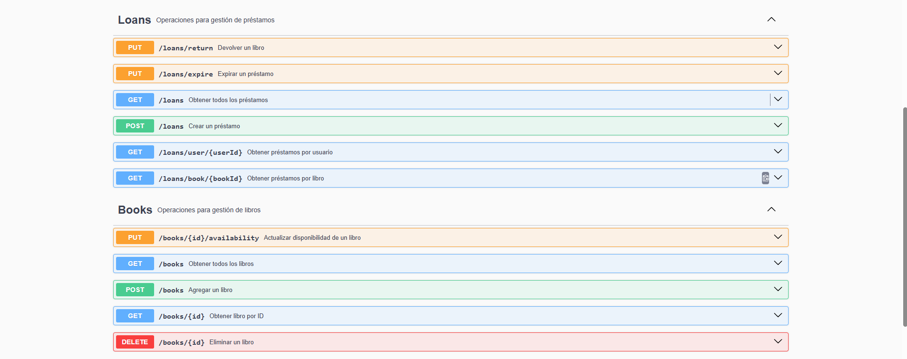
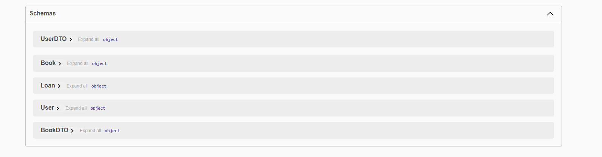
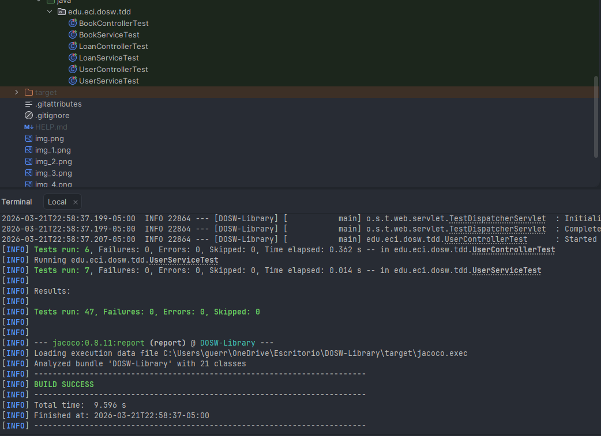
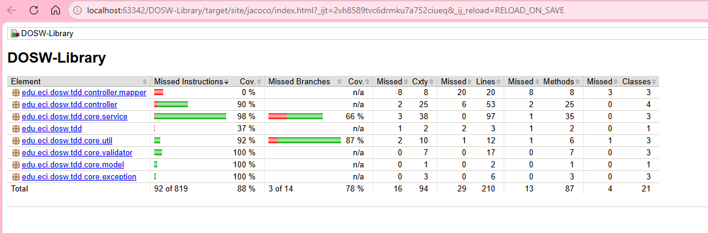
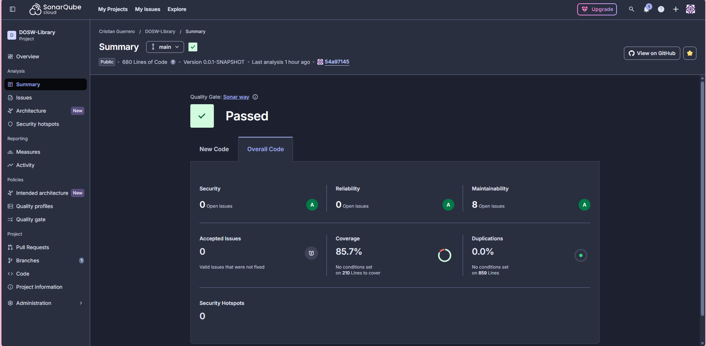

# DOSW-Library
Es una API REST para la gestión de una biblioteca universitaria, desarrollada como proyecto académico del curso DOSW 2 
en la Escuela Colombiana de Ingeniería Julio Garavito. El sistema permite administrar usuarios, libros y préstamos, 
implementando una arquitectura en capas, con validaciones de negocio, manejo 
centralizado de excepciones y cobertura de pruebas

### Funcionalidades principales
- Registro y consulta de usuarios
- Gestión del catálogo de libros (CRUD completo)
- Control de préstamos: creación, devolución y consulta de historial
- Documentación interactiva de la API con Swagger UI
- Validaciones de negocio: límite de préstamos activos, disponibilidad de libros, etc.

# Tabla de contenido  
[1. Descripción del proyecto](#descripción-del-proyecto)  

[2. Tecnologías y requisitos previos](#tecnologías-y-requisitos-previos) 

[3. Instalación y ejecución](#instalación-y-ejecución) 

[4. Estructura del proyecto](#estructura-del-proyecto) 

[5. Diagramas](#diagramas) 

[5.1 Diagrama general](#diagrama-general) 

[5.2 Diagrama específico](#diagrama-específico) 

[5.3 Diagrama de clases](#diagrama-de-clases) 

[6. Documentación de la API (Swagger)](#documentación-de-la-api) 

[7. Pruebas y cobertura](#pruebas-y-cobertura) 

[8. Manejo de errores](#manejo-de-errores) 

[9. Autores](#autores) 

# Tecnologías y requisitos previos

### Stack utilizado
- Java 21 — lenguaje principal

- Spring Boot 3.x — framework web y de inyección de dependencias

- Springdoc OpenAPI (Swagger UI) — documentación interactiva

- JUnit 5 + Mockito — pruebas unitarias y funcionales

- JaCoCo — reporte de cobertura de pruebas

- Checkstyle / SpotBugs — análisis estático

- Maven — gestión de dependencias y ciclo de build

### Requisitos previos
- Java 21 instalado (java -version)

- Maven 3.8+ (mvn -version)

- Git

# Estructura de proyecto
```
src/
├── main/
│   └── java/edu/eci/dosw/tdd/
│       ├── controller/
│       │   ├── dto/
│       │   │   ├── BookDTO.java
│       │   │   ├── LoanDTO.java
│       │   │   └── UserDTO.java
│       │   ├── mapper/
│       │   │   ├── BookMapper.java
│       │   │   ├── LoanMapper.java
│       │   │   └── UserMapper.java
│       │   ├── BookController.java
│       │   ├── ErrorResponse.java
│       │   ├── GlobalExceptionHandler.java
│       │   ├── LoanController.java
│       │   └── UserController.java
│       ├── core/
│       │   ├── exception/
│       │   │   ├── BookNotAvailableException.java
│       │   │   ├── LoanLimitExceededException.java
│       │   │   └── UserNotFoundException.java
│       │   ├── model/
│       │   │   ├── Book.java
│       │   │   ├── Loan.java
│       │   │   ├── Status.java
│       │   │   └── User.java
│       │   ├── service/
│       │   │   ├── BookService.java
│       │   │   ├── LoanService.java
│       │   │   └── UserService.java
│       │   ├── util/
│       │   │   ├── DateUtil.java
│       │   │   ├── IdGeneratorUtil.java
│       │   │   └── ValidationUtil.java
│       │   └── validator/
│       │       ├── BookValidator.java
│       │       ├── LoanValidator.java
│       │       └── UserValidator.java
│       └── DoswLibraryApplication.java
└── test/
    └── java/edu/eci/dosw/tdd/
        ├── BookControllerTest.java
        ├── BookServiceTest.java
        ├── LoanControllerTest.java
        ├── LoanServiceTest.java
        ├── UserControllerTest.java
        └── UserServiceTest.java
```

# Diagramas 

## Diagrama de clases






### Diagrama de Clases
El diagrama de clases refleja la arquitectura en capas del proyecto, separando responsabilidades en dos grandes paquetes:
core y controller.

### Paquete core

Es el núcleo del sistema y concentra toda la lógica de negocio. Se divide en cuatro subpaquetes:
model define las entidades principales del dominio: Book (libro con id, título, autor y disponibilidad), User 
(usuario con id y nombre) y Loan (préstamo que asocia un libro con un usuario, incluyendo fecha de préstamo, fecha de 
devolución y estado). El estado del préstamo está representado por el enum Status, que puede ser ACTIVE, RETURNED o EXPIRED.
service contiene la lógica de negocio a través de tres servicios: BookService gestiona el inventario de libros y sus 
copias disponibles; UserService administra el registro y consulta de usuarios; y LoanService orquesta la creación, 
devolución y expiración de préstamos, dependiendo de los dos servicios anteriores para operar. 

Cabe mencionar que en este paquete también se lanzan las excepciones de dominio (BookNotAvailableException, UserNotFoundException, 
LoanLimitExceededException), aunque estas no se representan explícitamente en el diagrama.
validator centraliza las reglas de validación de entrada: BookValidator verifica que un libro tenga datos válidos y 
copias positivas; UserValidator que el usuario tenga id y nombre; y LoanValidator que los identificadores de libro y 
usuario no estén vacíos. Todos delegan las validaciones puntuales en ValidationUtil.
util agrupa utilidades estáticas de uso transversal: ValidationUtil con métodos para validar nulos, blancos y positivos; 
DateUtil para obtener la fecha actual y verificar vencimientos; e IdGeneratorUtil para generar identificadores únicos con UUID.

### Paquete controller
Expone la API REST y adapta la comunicación entre el cliente y el núcleo del sistema. Contiene directamente las clases 
de controladores, DTOs, mappers y manejo de errores:
Los controladores BookController, UserController y LoanController reciben las peticiones HTTP y delegan en sus 
respectivos servicios. Cada uno depende también de su mapper correspondiente (BookMapper, UserMapper, LoanMapper), que 
se encarga de convertir entre los objetos de transferencia de datos (DTOs) y las entidades del modelo de dominio. 
Los DTOs (BookDTO, UserDTO, LoanDTO) son objetos simples que representan los datos que viajan en las peticiones y respuestas.
Finalmente, GlobalExceptionHandler intercepta las excepciones lanzadas en cualquier capa y las transforma en respuestas 
HTTP con el código de estado apropiado, usando ErrorResponse como estructura estandarizada de error con código y mensaje.


## Diagrama de Componentes Generales



El sistema se divide en dos grandes componentes: **Biblioteca Front**, que representa
la capa de presentación encargada de recibir las solicitudes HTTP del cliente, y
**Biblioteca Core**, que concentra toda la lógica de negocio, validaciones y acceso
a datos. La comunicación entre ambos se da a través de una interfaz provista
(notación lollipop), lo que desacopla la presentación del dominio. El componente
Core es el único con acceso directo a la base de datos (BD).

## Diagrama de Componentes Especificos



Este diagrama desglosa internamente cómo se relacionan los componentes para cada
entidad del sistema (Usuario, Libro y Préstamo). Cada flujo sigue el mismo patrón:

- El **Mapper** transforma los datos entre el DTO y el modelo de dominio antes
  de que lleguen al controlador.
- El **Controller** recibe la solicitud HTTP y la delega al servicio a través
  de una interfaz provista , manteniéndose desacoplado de la implementación.
- El **Service** contiene la lógica de negocio y delega las validaciones al
  **Validator**, que verifica las reglas de negocio antes de ejecutar cualquier
  operación.

Este patrón se repite de forma consistente en los tres módulos, garantizando
uniformidad arquitectónica en todo el sistema.

### Documentación de la API (Swagger)

La API está completamente documentada con Swagger. Con la aplicación corriendo, se puede acceder a la documentación 
interactiva en: http://localhost:8080/swagger-ui/index.html#/ Desde esta interfaz se pueden probar todos los endpoints
directamente sin necesidad de herramientas externas como Postman.







# Pruebas y cobertura

### Pruebas unitarias

Se implementaron 47 pruebas distribuidas en 6 clases, tanto pruebas de exito como de error para los 3 modulos del sistema



### Cobertura de pruebas - JaCoCo

El analisis de cobertura realizado por JaCoCo nos da los siguientes resultados



### Analisis estático — SonarQube

El analisis estatico se hizo con ayuda de SonarQube, y nos dejo los siguientes resultados




