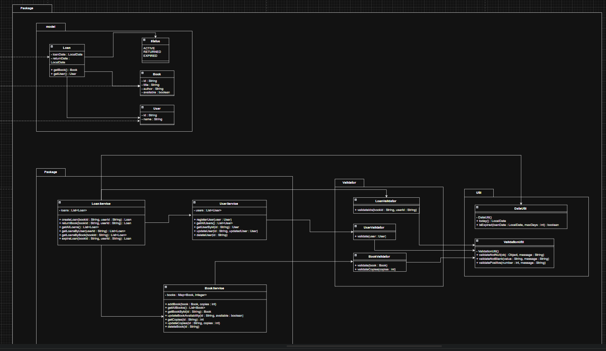
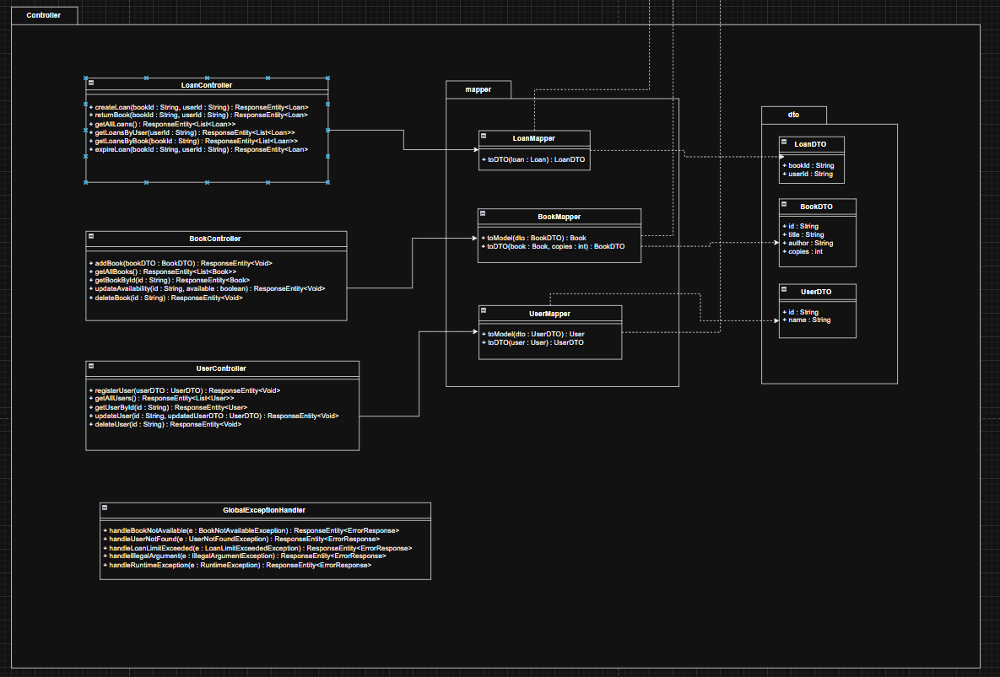

# DOSW-Library

API REST para la gestión de una biblioteca universitaria, desarrollada como proyecto académico del curso DOSW 2 en la Escuela Colombiana de Ingeniería Julio Garavito. El sistema permite administrar usuarios, libros y préstamos, implementando una arquitectura en capas con validaciones de negocio, manejo centralizado de excepciones, persistencia relacional con PostgreSQL, seguridad basada en JWT y cobertura de pruebas.

### Funcionalidades principales
- Registro y consulta de usuarios
- Gestión del catálogo de libros (CRUD completo)
- Control de préstamos: creación, devolución y expiración
- Persistencia relacional con PostgreSQL mediante Spring Data JPA
- Autenticación basada en JWT y autorización por roles (LIBRARIAN / REGULAR_USER)
- Documentación interactiva de la API con Swagger UI
- Validaciones de negocio: límite de préstamos activos, disponibilidad de libros, etc.

---

# Tabla de contenido

[1. Tecnologías y requisitos previos](#1-tecnologías-y-requisitos-previos)

[2. Instalación y ejecución](#2-instalación-y-ejecución)

[3. Estructura del proyecto](#3-estructura-del-proyecto)

[4. Diagramas](#4-diagramas)

- [4.1 Diagrama de componentes generales](#41-diagrama-de-componentes-generales)
- [4.2 Diagrama de componentes específicos](#42-diagrama-de-componentes-específicos)
- [4.3 Diagrama de clases](#43-diagrama-de-clases)
- [4.4 Diagrama entidad-relación (3FN)](#44-diagrama-entidad-relación-3fn)

[5. Documentación de la API (Swagger)](#5-documentación-de-la-api-swagger)

[6. Persistencia Relacional](#6-persistencia-relacional)

[7. Seguridad](#7-seguridad)

[8. Pruebas y cobertura](#8-pruebas-y-cobertura)

[9. Análisis estático](#9-análisis-estático)

[10. Manejo de errores](#10-manejo-de-errores)

[11. Demo funcional](#11-demo-funcional)

[12. Autores](#12-autores)

---

# 1. Tecnologías y requisitos previos

### Stack utilizado

- **Java 21** — lenguaje principal
- **Spring Boot 3.x** — framework web y de inyección de dependencias
- **Spring Data JPA / Hibernate** — capa de persistencia ORM
- **PostgreSQL** — base de datos relacional
- **Spring Security** — framework de seguridad
- **JWT (JSON Web Token)** — autenticación stateless
- **Springdoc OpenAPI (Swagger UI)** — documentación interactiva
- **JUnit 5 + Mockito** — pruebas unitarias y funcionales
- **JaCoCo** — reporte de cobertura de pruebas
- **Checkstyle / SpotBugs** — análisis estático
- **Maven** — gestión de dependencias y ciclo de build

### Requisitos previos

- Java 21 instalado (`java -version`)
- Maven 3.8+ (`mvn -version`)
- PostgreSQL instalado y corriendo
- Git

---

# 2. Instalación y ejecución
```bash
# Clonar el repositorio
git clone https://github.com/tu-usuario/DOSW-Library.git
cd DOSW-Library

# Compilar y ejecutar
./mvnw spring-boot:run
```

La aplicación quedará disponible en `http://localhost:8080`.

> Asegúrate de tener una base de datos PostgreSQL corriendo y configurada en `src/main/resources/application.yaml` antes de ejecutar.

---

# 3. Estructura del proyecto

```
src/
├── main/
│   └── java/edu/eci/dosw/tdd/
│       ├── controller/
│       │   ├── dto/
│       │   │   ├── BookDTO.java
│       │   │   ├── LoanDTO.java
│       │   │   └── UserDTO.java
│       │   ├── mapper/
│       │   │   ├── BookMapper.java
│       │   │   ├── LoanMapper.java
│       │   │   └── UserMapper.java
│       │   ├── BookController.java
│       │   ├── ErrorResponse.java
│       │   ├── GlobalExceptionHandler.java
│       │   ├── LoanController.java
│       │   └── UserController.java
│       ├── core/
│       │   ├── exception/
│       │   ├── model/
│       │   ├── service/
│       │   ├── util/
│       │   └── validator/
│       ├── persistence/
│       │   ├── entity/
│       │   │   ├── BookEntity.java
│       │   │   ├── LoanEntity.java
│       │   │   ├── LoanStatusEntity.java
│       │   │   ├── RoleEntity.java
│       │   │   └── UserEntity.java
│       │   ├── mapper/
│       │   │   ├── BookPersistenceMapper.java
│       │   │   ├── LoanPersistenceMapper.java
│       │   │   └── UserPersistenceMapper.java
│       │   └── repository/
│       │       ├── BookRepository.java
│       │       ├── LoanRepository.java
│       │       └── UserRepository.java
│       ├── security/
│       │   ├── JwtAuthenticationFilter.java
│       │   ├── JwtService.java
│       │   ├── SecurityAccessDeniedHandler.java
│       │   ├── SecurityEntryPoint.java
│       │   └── UserDetailsServiceImpl.java
│       ├── config/
│       │   ├── SecurityConfig.java
│       │   └── SwaggerConfig.java
│       └── DoswLibraryApplication.java
└── test/
└── java/edu/eci/dosw/tdd/
├── BookControllerTest.java
├── BookServiceTest.java
├── LoanControllerTest.java
├── LoanServiceTest.java
├── UserControllerTest.java
└── UserServiceTest.java
```

---

# 4. Diagramas

## 4.1 Diagrama de componentes generales


El sistema se divide en dos grandes componentes: **Biblioteca Front**, que representa la capa de presentación encargada de recibir las solicitudes HTTP del cliente, y **Biblioteca Core**, que concentra toda la lógica de negocio, validaciones y acceso a datos. La comunicación entre ambos se da a través de una interfaz provista (notación lollipop), lo que desacopla la presentación del dominio. El componente Core es el único con acceso directo a la base de datos.

## 4.2 Diagrama de componentes específicos


Este diagrama desglosa internamente cómo se relacionan los componentes para cada entidad del sistema (Usuario, Libro y Préstamo). Cada flujo sigue el mismo patrón:

- El **Mapper** transforma los datos entre el DTO y el modelo de dominio antes de que lleguen al controlador.
- El **Controller** recibe la solicitud HTTP y la delega al servicio a través de una interfaz provista, manteniéndose desacoplado de la implementación.
- El **Service** contiene la lógica de negocio y delega las validaciones al **Validator**, que verifica las reglas de negocio antes de ejecutar cualquier operación.

Este patrón se repite de forma consistente en los tres módulos, garantizando uniformidad arquitectónica en todo el sistema.

## 4.3 Diagrama de clases






El diagrama de clases refleja la arquitectura en capas del proyecto, separando responsabilidades en dos grandes paquetes: `core` y `controller`.

### Paquete core

Es el núcleo del sistema y concentra toda la lógica de negocio. Se divide en cuatro subpaquetes:

**model** define las entidades principales del dominio: `Book` (libro con id, título, autor y disponibilidad), `User` (usuario con id y nombre) y `Loan` (préstamo que asocia un libro con un usuario, incluyendo fecha de préstamo, fecha de devolución y estado). El estado del préstamo está representado por el enum `Status`, que puede ser `ACTIVE`, `RETURNED` o `EXPIRED`.

**service** contiene la lógica de negocio a través de tres servicios: `BookService` gestiona el inventario de libros y sus copias disponibles; `UserService` administra el registro y consulta de usuarios; y `LoanService` orquesta la creación, devolución y expiración de préstamos, dependiendo de los dos servicios anteriores para operar. En este paquete también se lanzan las excepciones de dominio (`BookNotAvailableException`, `UserNotFoundException`, `LoanLimitExceededException`).

**validator** centraliza las reglas de validación de entrada: `BookValidator` verifica que un libro tenga datos válidos y copias positivas; `UserValidator` que el usuario tenga id y nombre; y `LoanValidator` que los identificadores de libro y usuario no estén vacíos. Todos delegan las validaciones puntuales en `ValidationUtil`.

**util** agrupa utilidades estáticas de uso transversal: `ValidationUtil` con métodos para validar nulos, blancos y positivos; `DateUtil` para obtener la fecha actual y verificar vencimientos; e `IdGeneratorUtil` para generar identificadores únicos con UUID.

### Paquete controller

Expone la API REST y adapta la comunicación entre el cliente y el núcleo del sistema. Los controladores `BookController`, `UserController` y `LoanController` reciben las peticiones HTTP y delegan en sus respectivos servicios. Cada uno depende de su mapper correspondiente (`BookMapper`, `UserMapper`, `LoanMapper`), encargado de convertir entre DTOs y entidades del dominio. Finalmente, `GlobalExceptionHandler` intercepta las excepciones lanzadas en cualquier capa y las transforma en respuestas HTTP con el código de estado apropiado, usando `ErrorResponse` como estructura estandarizada de error.

## 4.4 Diagrama entidad-relación (3FN)

> *(Agrega aquí la imagen de tu diagrama ER)*

El modelo relacional está diseñado bajo la Tercera Forma Normal (3FN), eliminando dependencias transitivas y redundancias. Se compone de tres tablas principales:

- **users** — almacena los datos del usuario junto con su rol.
- **books** — almacena la información del libro, el total de copias y las copias disponibles.
- **loans** — tabla de intersección que relaciona un usuario con un libro, registrando las fechas del préstamo y su estado (`ACTIVE`, `RETURNED`, `EXPIRED`).

---

# 5. Documentación de la API (Swagger)

La API está completamente documentada con Swagger. Con la aplicación corriendo, se puede acceder a la documentación interactiva en:
```
http://localhost:8080/swagger-ui/index.html
```
Desde esta interfaz se pueden explorar y probar todos los endpoints directamente sin necesidad de herramientas externas como Postman. Para los endpoints protegidos, se debe hacer login en `/auth/login`, copiar el token JWT retornado y pegarlo en el botón **Authorize 🔒** de Swagger.


---

# 6. Persistencia Relacional

Se integró **Spring Data JPA** con **PostgreSQL** como capa de persistencia del sistema. Se agregó una nueva capa `persistence` dentro de la arquitectura, al mismo nivel que `controller` y `core`, compuesta por tres subpaquetes:

- **entity** — clases `@Entity` que mapean directamente las tablas de la base de datos (`UserEntity`, `BookEntity`, `LoanEntity`). Se utilizaron las anotaciones JPA necesarias (`@Id`, `@Column`, `@ManyToOne`, `@Enumerated`, entre otras) para reflejar el modelo relacional.
- **mapper** — clases encargadas de convertir entre las entidades JPA y los modelos de dominio del `core`, manteniendo el desacoplamiento entre capas.
- **repository** — interfaces que extienden `JpaRepository`, proveyendo las operaciones CRUD y consultas personalizadas necesarias para cada entidad.

Los repositorios fueron inyectados en los servicios del `core`, reemplazando completamente el uso de estructuras en memoria. La conexión con la base de datos se configuró en `application.properties`.

---

# 7. Seguridad

Se implementó una capa de seguridad completa sobre la API utilizando **Spring Security** y **JWT**, abordando tres conceptos fundamentales:

### Autenticación
El sistema expone el endpoint público `POST /auth/login`, donde el usuario envía sus credenciales. Si son válidas, se genera y retorna un token JWT firmado con una clave secreta y un tiempo de expiración definido (TTL). A partir de ese momento, el cliente debe incluir el token en cada petición mediante el header `Authorization: Bearer <token>`.

### Autorización
Se definieron dos roles con permisos diferenciados:

- **LIBRARIAN** — puede gestionar libros, usuarios y todos los préstamos.
- **REGULAR_USER** — puede consultar libros, crear préstamos, devolver libros y consultar únicamente sus propios préstamos.

Los permisos se aplican mediante la anotación `@PreAuthorize` en cada endpoint del controlador. Un usuario `REGULAR_USER` que intente acceder a un recurso administrativo recibe `403 Forbidden`, y cualquier petición sin token o con token inválido recibe `401 Unauthorized`.

### Integridad
El token JWT está firmado digitalmente, lo que permite detectar cualquier intento de alteración. La firma garantiza que la información del token proviene de una fuente confiable y no ha sido modificada durante su transmisión.

### Configuración adicional
- La API opera en modo **stateless** (sin sesiones en servidor).
- Se deshabilita **CSRF** al no aplicar para APIs REST con JWT.
- Se configuró **CORS** para permitir el consumo desde otros dominios.
- Se implementaron handlers personalizados para retornar respuestas estandarizadas ante errores de seguridad (`SecurityEntryPoint` para 401, `SecurityAccessDeniedHandler` para 403).

---

# 8. Pruebas y cobertura

### Pruebas unitarias

Se implementaron 47 pruebas distribuidas en 6 clases, cubriendo tanto escenarios de éxito como de error para los tres módulos del sistema.


### Cobertura de pruebas — JaCoCo

El análisis de cobertura realizado por JaCoCo muestra los siguientes resultados:


---

# 9. Análisis estático

El análisis estático se realizó con SonarQube, con los siguientes resultados:


---

# 10. Manejo de errores

El sistema centraliza el manejo de errores mediante `GlobalExceptionHandler`, que intercepta las excepciones lanzadas en cualquier capa y las convierte en respuestas HTTP estandarizadas. La estructura de respuesta de error es la siguiente:
```json
{
  "status": 400,
  "message": "El ID del libro no puede estar vacío"
}
```

| Excepción | Código HTTP |
|---|---|
| `BookNotAvailableException` | 409 Conflict |
| `UserNotFoundException` | 404 Not Found |
| `LoanLimitExceededException` | 409 Conflict |
| `IllegalArgumentException` | 400 Bad Request |
| `AccessDeniedException` | 403 Forbidden |
| Otras excepciones | 500 Internal Server Error |

---

# 11. Demo funcional

### Demo Parte 1 — Persistencia Relacional

Video demostrativo evidenciando las operaciones CRUD sobre la base de datos PostgreSQL:

> *https://drive.google.com/file/d/1Lg_qVran2KX7KH32fVdsZkUXk78WyQ2y/view?usp=sharing*

### Demo Parte 2 — Seguridad (Autenticación y Autorización)

Video demostrativo evidenciando el flujo de login, obtención del JWT y control de acceso por roles:

> *https://drive.google.com/file/d/1dOtp6r3oaGsOqpx3KUU13B5fyOk-YTqT/view?usp=drive_link*

---

# 12. Autores

Desarrollado por Cristian Guerrero del curso DOSW 2 — Escuela Colombiana de Ingeniería Julio Garavito.